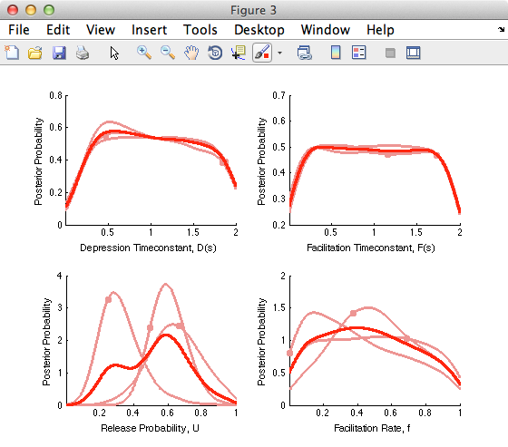
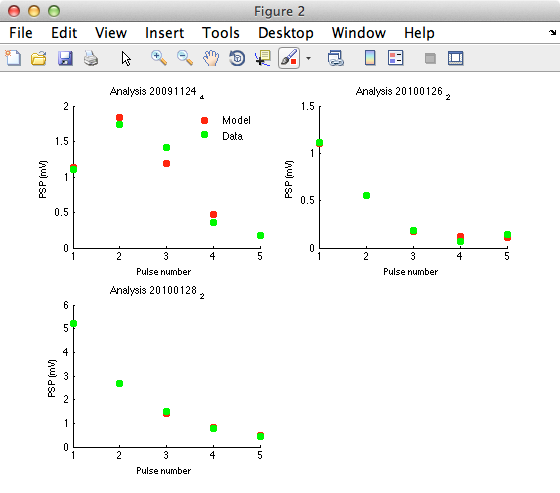

<html><pre>
********************************************************************************
*  Probabilistic Inference of Short-term Synaptic Plasticity - inference code  *
*  Model: Tsodyks-Markram (2-4 parameters)				       *
*									       *
*  Version: v0.1 (06/2013)						       *
*  Author: Rui Ponte Costa (rui.costa@dpag.ox.ac.uk)				       *
*  Paper link: https://frontiersin.org/articles/10.3389/fncom.2013.00075    *
********************************************************************************

>> How to install:

 1 - Install Matlab (with Statistical Toolbox).
 2 - Open Matlab > Go to STPInference folder

>> How to run:

 1 - Type TM_GUI in the command line
 2 - Open a XLS file (example given in data/examplePCPC.xls) Options:
      Age, frequency and minimum number of pulses.
 3 - Press Run (should take approximately one minute per datapoint) 
 4 - The maximum a posterior (MAP) solutions are given in the main
 window and the respective coefficient of determination (R^2). This is
 a subset of the information in the paper's Fig. 4b and Fig. 6a, only
 for one of the connection types (PC-PC) and a subset of the
 datapoints (n=3):

 5 - Finally, the plots (posterior and MAP solutions) can be saved in
 PDF format

>> Problems:

   - If the toolbox Kernel Density Estimation (KDE) Toolbox
     (http://www.ics.uci.edu/~ihler/code/kde.html) is not recognised,
     delete the current version, download and compile it in the
     STPInference/toolboxes directory.

</pre></html>
